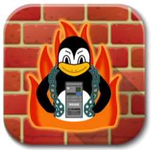

# Firewall

Firewall Plugin for DeChainy to be installed within the framework.

## Quick links

Here follows a list of useful guides:

* [Introduction](docs/README.md)
* [API Doc](docs/api)

## License

Firewall is licensed under the Apache License, Version 2.0 (ALv2).
